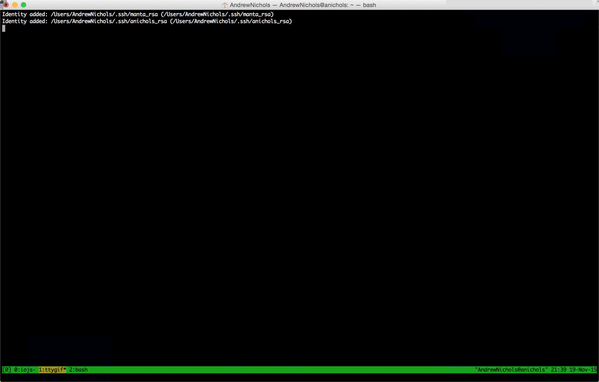

[](https://travis-ci.org/tandrewnichols/log-block) [](https://npmjs.org/package/log-block) [](https://npmjs.org/package/log-block) [](https://codeclimate.com/github/tandrewnichols/log-block) [](https://codeclimate.com/github/tandrewnichols/log-block) [](https://david-dm.org/tandrewnichols/log-block) 

# log-block

Logging utility to generate nice looking log blocks

## Installation

`npm install --save log-block`

## Summary

A wrapper around console.log to add a blank line before and after and indent the items being logged.



## Usage

```js
var block = require('log-block');
block('foo', 'bar'); // Multiple strings are logged on the same line
block(['foo', 'bar'], ['baz', 'quux']); // Each array will be logged on it's own line
block(['foo', 'bar'], { baz: 'quux' }); // Objects will be stringified
```

Also works nicely in combination with [chalk](https://github.com/chalk/chalk). E.g.

```js
block(
  [chalk.green('Something good happened')],
  [chalk.red('Oh no! Something bad happened')]
);
```

### Browser

Serve `dist/log-block.js` or `dist/log-block.min.js` and then access `log-block` via `window.logBlock`.

## Contributing

Please see [the contribution guidelines](CONTRIBUTING.md).
